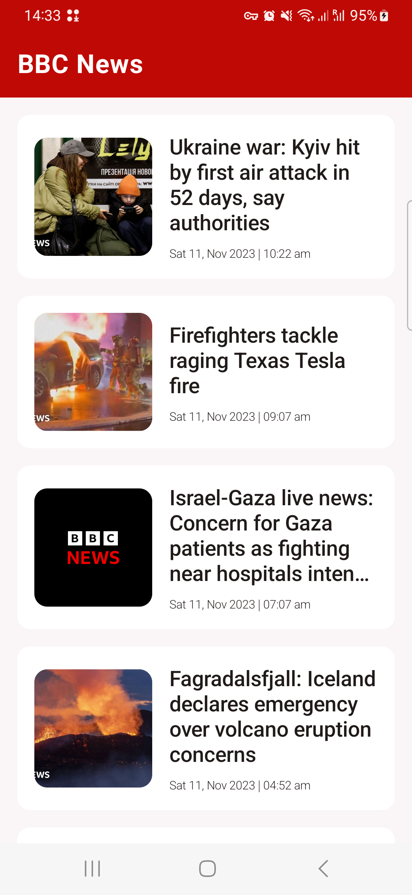
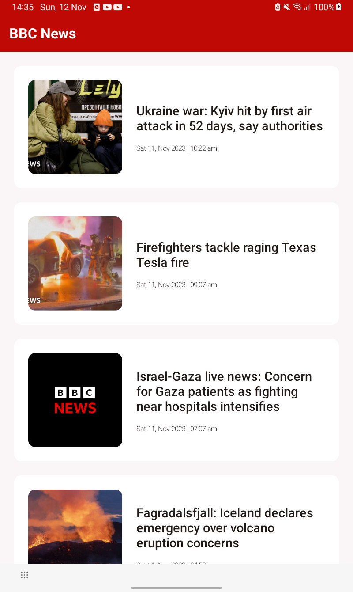
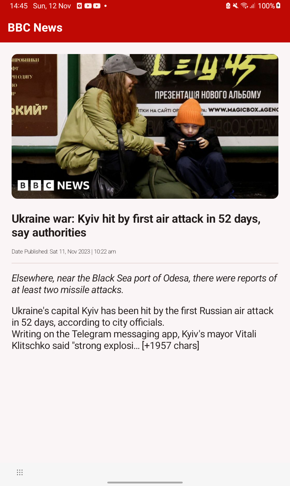
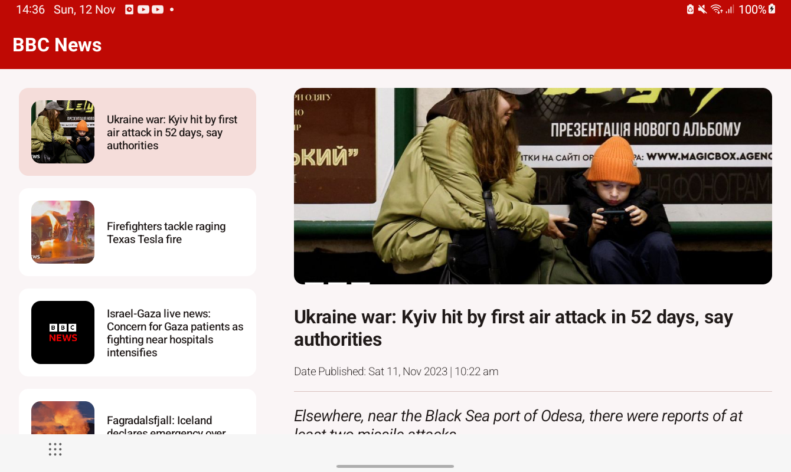

# TopHeadlinesApp
TopHeadlinesApp is a sample news app that uses the 
[News API](https://newsapi.org/docs/endpoints/top-headlines) to fetch BBC News headlines.

## Features
The application has the following features
* List of headlines on the first screen
* Show a details screen when list item clicked
* Fingerprint Login if device supports biometrics and the device is enrolled
* Support for multiple screen sizes

## Tools

* Kotlin
* Coroutines 
* Kotlin Flows
* MVVM, Clean Architecture
* Jetpack Compose
* Koin
* Retrofit
* JUnit4 and MockK

## Setup
* Clone the project and run it
* Get an API Key from [News API](https://newsapi.org)
* In local.properties file, create a property called NEWS_API_KEY="your_api_key"

## Screenshots

* News List (Phone Portrait)

* News Detail (Phone Portrait)

* News List (Tablet Portrait)

* News Detail (Tablet Portrait)

* Tablet Landscape

